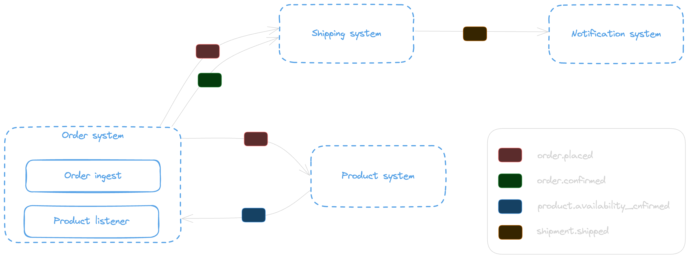

# Intro

This folder holds all the code samples supporting the  Event model standards study

## Why define standards on our event envelope?

Defining a standard event envelope not only simplifies and accelerates cross-domain communication but also intra-domain communication, this can provide many benefits including consumption, simplified decision-making, and observability. By implementing these standards we can greatly improve:

* Discoverability and documentation of EDAs
* The way event consumers are processing events (e.g. Event Filtering)
* Observability of distributed systems

## Samples schema



## Deploy the solution
The solution has 5 projects that must be deployed in the following order.
The extension and event schema discovery stack must be deployed first and will be used by application stacks

```shell
npm run build:extension --prefix src/platform/src
npm run cdk:extension:dev deploy --prefix src/platform/cdk -- --all --require-approval never
```

Deploying the application stacks

```shell
npm run cdk:orders deploy -- --all --require-approval never
npm run cdk:products deploy -- --all --require-approval never
npm run cdk:shipment deploy -- --all --require-approval never
npm run cdk:notification deploy -- --all --require-approval never
```

Deploying the Catalog stack will be done by deploying first the Catalog stack followed by the Catalog Pipeline stack.

```shell
npm run cdk:catalog:dev deploy --prefix src/platform/cdk -- --all --require-approval never
```

> The repository has a github action to sync the specification in `specs` folder for any service ( this let simulate how to synchronize specs from many repositories into the spec s3 bucket), the github action needs the AWS credentials to be setup for the repository or organization, you can use an idp but for this example we need to add two secrets for the repository, AWS_ACCESS_KEY_ID and AWS_SECRET_ACCESS_KEY

## Add a product

```json
{
  "productId":"PRD_12345643",
  "price":500,
  "stock":1,
  "status":"IN_STOCK"
}
```

## Send an order

Sending to order queue

```json
{
  "data": {
    "orderDate": "2024-01-01T12:55:00.990Z",
    "price": 1000,
    "quantity": 2,
    "productId": "PRD_12345643",
    "userId": "d793cc1a-5477-45b7-9a89-778835ab2482"
  }
}
```

sending via apigatway

```json
{
  "orderDate": "2024-01-01T12:55:00.990Z",
  "price": 1000,
  "quantity": 2,
  "productId": "PRD_12345643",
  "userId": "d793cc1a-5477-45b7-9a89-778835ab2482"
}
```

* While the product is `unavailable` the order shipment gets `cancelled`
* Relying Order to Product availability done using `causationId`

## Increase Stock

```json
{
  "productId":"PRD_12345643",
  "price":500,
  "stock":10,
  "status":"IN_STOCK"
}
```

* order will be confirmed

## Shipment get triggered

* As soon as the order placed event is disseminated by order service shipment will plan the package preparation.
* Per unavailability of product the shipment by receiving the `order.cancelled` event will stop the shipment process.
* Per the availability of the product and order confirmation in Order service, Shipment service will ship the package by receiving the `order.confirmed` event.
* Shipment service will send a `shipment.shipped` event.

## Cloudwatch Log insights

fields @timestamp, message.id, message.type, message.dataversion, message.recipient, message.source, message.causationid, message.correlationid
| sort @timestamp desc
| limit 1000
| filter ispresent(message.specversion)

## Cloudwatch Pie Widget

fields @timestamp, message.id, message.type, message.dataversion, message.recipient, message.source, message.causationid, message.correlationid
| sort @timestamp desc
| limit 1000
| filter ispresent(message.specversion)
| stats count() by message.source, message.type, message.dataversion

## Clean Up

To clean the created deployed stacks

```shell
npm run cdk:orders destroy -- --all
npm run cdk:products destroy -- --all
npm run cdk:shipment destroy -- --all 
npm run cdk:notification destroy -- --all
npm run cdk:extension:dev destroy --prefix src/platform/cdk -- --all --require-approval never
npm run cdk:catalog:dev destroy --prefix src/platform/cdk -- --all --require-approval never
```

## Remove Generated folders ( Useful for clean guys )

```shell
find . -name 'node_modules' -type d -prune -exec rm -rf '{}' +
find . -name 'cdk.out' -type d -prune -exec rm -rf '{}' +
find . -name '.DS_Store' -prune -exec rm -rf '{}' +
```
